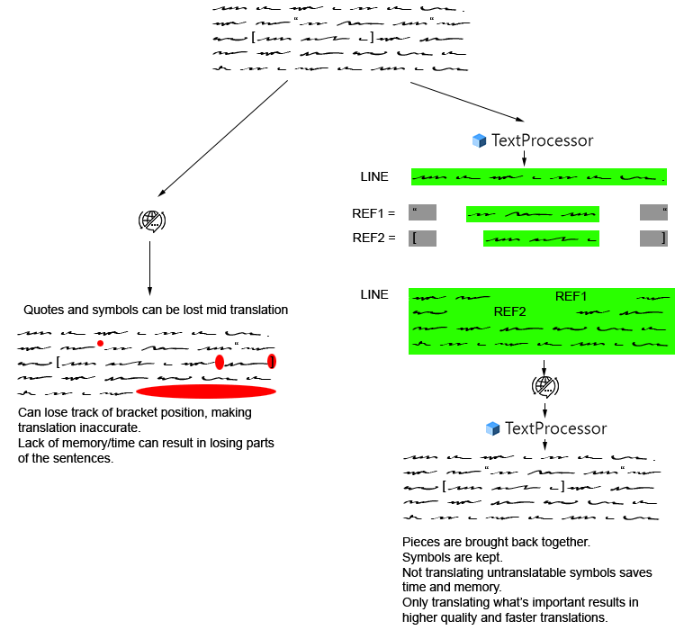

# mtl-text-processor!

 [](https://choosealicense.com/licenses/gpl-3.0/)

> A set of tools to pre-process for translation (by machine translators) and post-process the results back into the full sentence.

<!-- ## Demo
#### [Link to demo here](https://github.com/reddo9999/mtl-text-processor#readme) -->

## Get started

Install:

```bash
npm -i mtl-text-processor
```

Use it in your project:

```js
const { TextProcessor } = require('mtl-text-processor');
let myProcessor = new TextProcessor({myOptions});
let myProcess = myProcessor.process("My text.");
let translatableStrings = myProcess.getTranslatableLines();
/**
 * Send translatableStrings (Array<string>) to the translator.
 * Store response as an array in translationResult.
 */
myProcess.setTranslatedLines(...translationResult);
let translatedText = myProcess.getTranslatedLines();
```

The use will vary a bit according to the translator you are using. If your translator already accepts Arrays and already returns Arrays, you're good to go. If your translator can only work with one string at a time, then you'd need to get the entire array before you can use it. But you don't have to deliver all translations at once:

```js
// ...
translatableStrings.forEach(translatableLine => {
    let translation = sendToMyTranslator(translatableLine);
    myProcess.setTranslatedLines([translation]);
});
let translatedText = myProcess.getTranslatedLines();
```

# Why?

Machine Translators are great. But most Machine Translators can't handle being thrown a ton of text at once - if they don't outright crash, they will produce less than ideal translations.

This Text Processor has the main goal of safeguarding untranslatable symbols, but the way in which this is achieved also results in smaller sentences which are translated in isolation and then put back together. This is just a big win when the different sentences already have no relation to the others (like two entirely separate sentences that are only related by the fact that they are used in sequence, with no refences at all). Translation in isolation is also beneficial when translating a symbol (like a name, or a sub-sentence inside brackets, makes it more consistent).

This processor attempts to give the Machine the contextual information of "A thing is in this part of the sentence", but without overwhelming them with the entire content of that symbol.



## Overview of uses
- **Escaping Symbols:** Allows setting up Regular Expressions to catch and remove untranslatable symbols, like scripts. Can also be used to save the translation of names for later - the translator will be fed a Placeholder Symbol instead of the original sequence. Most translators have support to certain symbols that are understood as "a thing", which allows the translator to still have the benefit of context, but without having to actually deal with the hard to understand original sequence.
    - Can be used for untranslatable scripts (\\n[0] used as a name, or an actual script call).
    - Can be used if you have a manually crafted translation for a name (instead of having the translator translate the name, it will maintain the Placeholder).
    - There are many choices of placeholders. Ideal placeholder choice varies with translator. Some translators, like Google and DeepL, for instance, are able to understand symbols such as {{A}} as something that has relevance in the context, but that should not be touched. Other translators will handle symbols such as %A better.
- **Isolating Sentences:** Internal parts of a sentence can be isolated for translation. Their place in the original sentence will be replaced by a placeholder.
- **Sentence Splitting:** Sentences can be split in reasonable points so that each part is translated in isolation.
    - Most translators are not able to properly handle multiple paragraphs in a row, so by splitting sentences on new paragraphs, better translation quality can be achieved. It's faster and cheaper, too!
- **Protected Untranslatables:** Parts of a sentence can easily not even be sent to the translator at all, like the bounding brackets of a quote - the TextProcessor will store them until it gets the translation for what's inside, then put it back together again.

## Author

#### [@reddo9999](https://www.github.com/reddo9999)

## License

#### [GNU General Public License v3.0](https://choosealicense.com/licenses/gpl-3.0/)

---

README created with ❤️ by [md-generate](https://www.npmjs.com/package/md-generate)